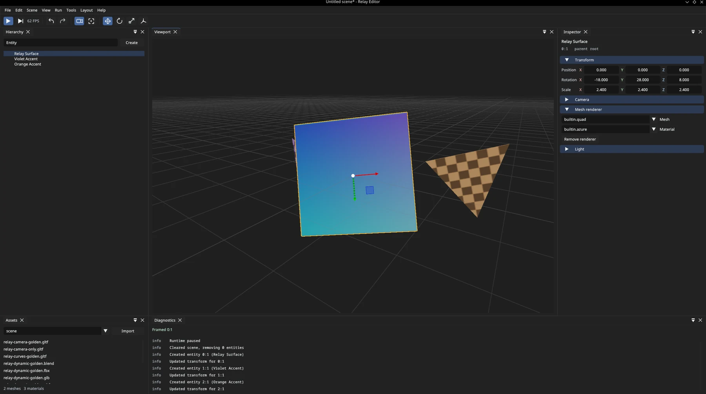
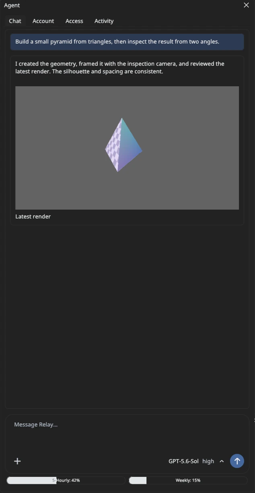
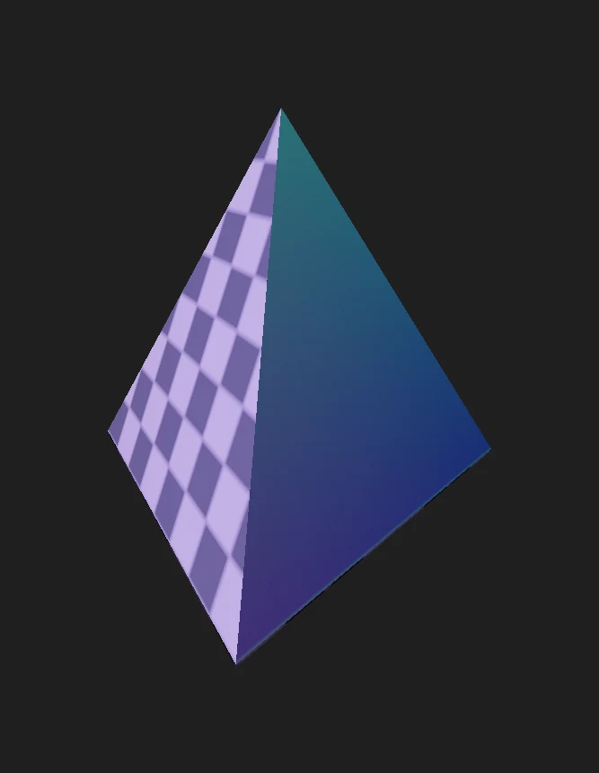
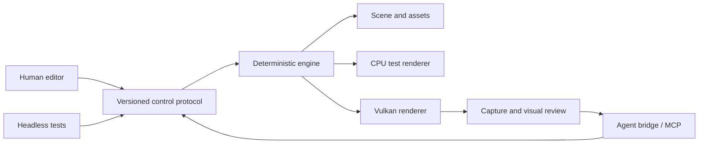

<p align="center">
  
</p>

<h1 align="center">Relay Engine</h1>

<p align="center">
  A native 3D workspace where people and software agents build together.
</p>

<p align="center">
  
  
  
</p>



Relay is an experimental game engine and editor built around a shared control surface. Human UI,
automation, tests, and model tools all operate through the same typed protocol. Agents can inspect
the scene, edit it, render the result, review captures, and correct their work while a person stays
in control of the same project.

## Highlights

- **Native editor** — dockable hierarchy, inspector, viewport, assets, history, diagnostics, and
  animation controls built with SDL3, Dear ImGui, and ImGuizmo.
- **Agent workspace** — embedded chat, OpenAI sign-in, model and reasoning controls, file
  attachments, inline media, usage meters, and permission management.
- **Visual feedback loop** — agents can frame objects, control an inspection camera, capture the
  Vulkan viewport, inspect the image, and iterate.
- **One typed API** — 85 versioned native methods cover scene editing, rendering, projects,
  observability, capture, and session authorization. A generated MCP bridge exposes the supported
  model-facing subset.
- **Deterministic core** — fixed-step simulation, transactional undo/redo, strict scene validation,
  and a CPU renderer used as a headless test oracle.
- **Practical asset pipeline** — glTF/GLB, OBJ, FBX, DAE, and sandboxed Blender conversion on Linux,
  with PBR materials, animation, skinning, morph targets, cameras, punctual lights, stabilized
  cascaded directional shadows, and spot shadows.

## Built-in agent workspace

<p align="center">
  
</p>

The Agent panel keeps conversation, file attachments, rendered images and videos, model controls,
permissions, activity, and account usage inside the editor. Agents work against the same live scene
as the human operator and can use viewport captures to check and refine their results.

<p align="center">
  
  <br>
  <sub>A scene assembled and reviewed through Relay's agent tools.</sub>
</p>

## Project status

Relay is a Linux-first research project under active development. The editor, Vulkan renderer,
scene workflow, import pipeline, control protocol, MCP bridge, and embedded agent workspace are
functional. APIs and file formats may still change. Windows and macOS renderer parity, broader
import sandboxing, and sustained live-provider validation remain in progress.

## Build

You need CMake 3.25+, Ninja, Python 3.10+, and a C++20 compiler. The graphical editor additionally
needs SDL3, Vulkan, and `glslc`. CMake fetches pinned Dear ImGui and ImGuizmo sources when the editor
is enabled.

```sh
cmake --preset dev
cmake --build --preset dev
./build/dev/relay_demo
```

The command above opens the SDL/Vulkan demo. For a display-free runtime:

```sh
./build/dev/relay_demo --headless
```

### Agent bridge

The bridge requires Node.js 24+ and a current Codex CLI with App Server support.

```sh
npm --prefix tools/mcp-bridge install
npm --prefix tools/mcp-bridge run build
./build/dev/relay_demo --editor
```

The final command opens the full editor and starts its agent bridge.

Open **Agent → Account** to sign in with ChatGPT or configure a compatible API. Relay keeps provider
credentials, conversation state, attachments, and logs under the ignored `.relay/` directory.
Every model action still crosses the native session authorization boundary.

## Test

The regular suite runs without controlling the desktop:

```sh
cmake --build --preset dev
ctest --preset dev
npm --prefix tools/mcp-bridge test
```

Windowed smoke tests live under `tests/editor_*_smoke.py`; they are intended for deliberate manual
or dedicated-desktop runs because they move focus and synthesize input.

## Architecture



The engine library has no model-provider dependency. Provider integration and canonical chat state
live in the external TypeScript bridge; permission checks and mutations remain native. The protocol
schema generates its C++, TypeScript, and reference documentation, preventing the surfaces from
drifting apart.

## Documentation

- [Protocol reference](docs/protocol.md) — generated methods, parameters, and safety annotations
- [Agent bridge](tools/mcp-bridge/README.md) — provider integration and bridge behavior
- [Engineering handoff](HANDOFF.md) — current implementation state, limits, and next priorities
- [Agent instructions](AGENTS.md) — repository working and verification rules

## Near-term direction

1. Validate and improve long-running live-provider sessions.
2. Expand renderer correctness with point-light/multi-light shadows, HDR, and resource streaming.
3. Add Windows and macOS backend and import-sandbox parity.
4. Continue game-authoring, packaging, and export workflows.

Relay currently targets local, single-user authoring. Treat project files and imported assets as
untrusted input; the loader, protocol, and importer intentionally fail closed at their boundaries.
