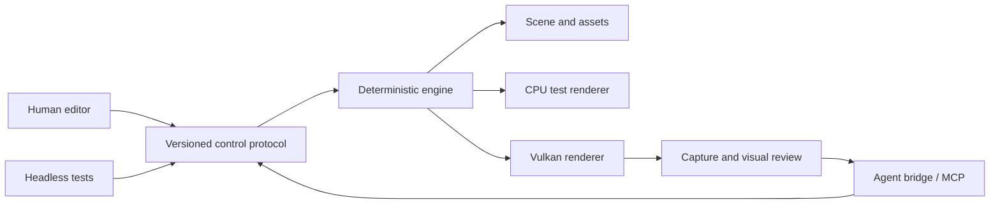

<p align="center">
  
</p>

<h1 align="center">Relay Engine</h1>

<p align="center">
  A native 3D workspace where people and software agents build together.
</p>

<p align="center">
  
  
  
</p>


Relay is an experimental game engine and editor built around a shared control surface. Human UI,
automation, tests, and model tools all operate through the same typed protocol. Agents can inspect
the scene, edit it, render the result, review captures, and correct their work while a person stays
in control of the same project.

## Highlights

- **Native editor** — dockable hierarchy, inspector, viewport, assets, history, diagnostics, and
  animation controls built with SDL3, Dear ImGui, and ImGuizmo.
- **Agent workspace** — embedded chat, OpenAI sign-in, model and reasoning controls, file
  attachments, inline media, usage meters, and permission management.
- **Visual feedback loop** — agents can frame objects, control an inspection camera, capture the
  Vulkan viewport, inspect the image, and iterate.
- **HDR lighting** — a floating-point scene target, camera exposure, procedural environment
  lighting, and tone mapping produce the final SDR viewport and captures.
- **One typed API** — 105 versioned native methods cover scene editing, rendering, projects,
  observability, capture, and session authorization. A generated MCP bridge exposes the supported
  model-facing subset.
- **Deterministic core** — fixed-step simulation, transactional undo/redo, strict scene validation,
  and a CPU renderer used as a headless test oracle.
- **Editor and game modes** — the editor does not advance simulation. **Run Game** starts a
  temporary scene session; **Stop Game** restores the authored scene. Pause and single-frame step
  remain available while the game runs.
- **Practical asset pipeline** — glTF/GLB, OBJ, FBX, DAE, and sandboxed Blender conversion on Linux,
  with PBR materials, animation, skinning, morph targets, cameras, punctual lights, stabilized
  cascaded directional shadows, spot shadows, and point-light cubemap shadows.
- **Bounded GPU uploads** — explicit staging and estimated device-memory limits, upload telemetry,
  and transfer-queue mip generation when a dedicated queue is available.
- **Scene authoring and export** — editable, undoable transform keyframes and portable project tar
  packages of saved scenes and assets.
- **Jolt physics** — authored box, sphere, capsule, convex-hull, and triangle-mesh colliders support
  overlap checks and raycasts.
  Static and dynamic rigid bodies provide gravity, momentum, friction, bounce, and angular motion
  during Run Game. Runtime impulses can be applied at a world-space point through the protocol.

The editor remembers its layout between sessions and builds: docked and floating panels, which
panels are open, and the **View** menu toggles. They are saved per user in
`~/.config/relay-engine/editor-layout.ini` on Linux (`%APPDATA%\Relay` on Windows,
`~/Library/Application Support/Relay` on macOS). **Layout → Reset layout** restores the default
arrangement, and `RELAY_EDITOR_LAYOUT_PATH` points the editor at another file.

The **Hierarchy** lists the scene's entities. Right-click empty space to create an entity, or a row
to add a child, duplicate, move, rename, or destroy it. Rename in place with **F2**, **Rename** in
the context menu, or a second, slower click on the selected row; **Enter** or clicking away
commits and **Escape** cancels. Drag rows onto each other to reparent them.

The **Assets** panel shows the open project folder as a tree. Expand a folder with its arrow, a
double-click, or the arrow keys. Right-click empty space to create a folder at the top level, or a
folder to create one inside it; right-click any entry to rename or delete it. **F2** and **Delete**
also work. Deleting moves the entry into the project's hidden `.relay-trash` folder, where it can
be recovered by hand. Drag entries onto a folder to move them there, or onto the empty space below
the tree to move them to the top level. Type in the search box (**Ctrl+F** while the panel is
focused) to find assets by name anywhere in the project, and use the funnel button to show only
models, scenes, images, shaders, scripts, text, audio and video, folders, project files, or other
files; the menu stays open so several categories can be ticked at once. Right-click an entry and
choose **Open in file browser** to show it in your system file manager.
Results list each match with its folder; double-click a folder result or choose **Show in
folder** to jump back to the tree there. **Escape** clears the search. The project file and the project's member
scenes cannot be moved or deleted from here. To bring a model into the scene, double-click it,
drag it into the viewport (it lands on the ground under the pointer) or onto a hierarchy row
(it becomes a child), or right-click it and choose **Import to scene**.

Select an entity and open **Transform keyframes** in the Inspector to add, edit, scrub, or play
position, rotation, and scale keys. To share a project, save its scenes, then use **Export saved
project** in the Project panel. Relay writes an uncompressed `.tar` under that project's `exports/`
folder, containing the project metadata, member scenes, and non-hidden assets. Export refuses to
overwrite an existing package.

Use **Run Game** from the toolbar or Run menu to test the current scene. The game viewport uses the
active scene camera. Scene edits and saves are unavailable during the run; **Stop Game** restores
the scene as it was when the run began. Pause and frame step control the running game only.
Select an entity and open **Collider** in the Inspector to add a box, sphere, capsule, convex hull,
or triangle mesh. Convex and mesh colliders use the entity's renderer mesh unless you choose a
separate collision mesh; the other shapes are independent of the visible mesh. Its layer and mask determine which other colliders it can overlap; raycasts can also
filter by layer. The queries report intersections without changing objects. The editor camera
outlines each collider's shape in the viewport: selected colliders are amber, enabled colliders
are green, and disabled colliders are gray. Toggle them with **View → Collider wireframes**.
Sphere and capsule shapes use the largest world scale axis as their uniform scale. Convex and mesh
colliders follow the full scale, including non-uniform scale. Triangle meshes suit static floors
and level geometry; a dynamic body with a mesh collider uses the mesh's convex hull instead.
The editor viewport also shows clickable camera and light icons. Directional, point, and spot
lights have distinct markers; selecting a camera shows a compact perspective or orthographic
view guide. The guide preserves the camera's field of view and aspect but caps its display size.
These guides can be toggled from **View** and stay out of Run Game.
Open **Physics body** in the Inspector to make an object static or dynamic. Dynamic bodies fall
under gravity and respond to enabled colliders during Run Game. A collider without a body is
static. Mass, gravity scale, bounciness, friction, and linear/angular damping are editable;
Stop Game restores authored positions. Jolt uses continuous collision detection for dynamic
bodies. An off-center `physics.apply_impulse` command adds rotation as well as linear motion.
Bodies with transform keyframes follow those keys rather than dynamic simulation.
The Inspector clamps a box-collider half extent entered as zero to 0.01 units, so thin floors
remain valid. Protocol requests with zero extents are rejected.
During Run Game, `physics.contact_events` reports contact `begin` and `end` pairs in sequence
order. Pass the last sequence as `after` to read new events; `oldest_sequence` shows when older
events have left the bounded history. Stop Game clears the stream.

## Built-in agent workspace

<p align="center">
  
</p>

The Agent panel keeps conversation, file attachments, rendered images and videos, model controls,
permissions, activity, and account usage inside the editor. Agents work against the same live scene
as the human operator and can use viewport captures to check and refine their results.

<p align="center">
  
  <br>
  <sub>A scene assembled and reviewed through Relay's agent tools.</sub>
</p>

## Project status

Relay is a Linux-first research project under active development. The editor, Vulkan renderer,
scene workflow, import pipeline, control protocol, MCP bridge, and embedded agent workspace are
functional. APIs and file formats may still change. Windows and macOS renderer parity, broader
import sandboxing, and sustained live-provider validation remain in progress.

The next engine work is gameplay scripting tied to Run Game and Stop Game, using the new collision
contact begin/end stream. Joints follow those foundations.

## Build

You need CMake 3.25+, Ninja, Python 3.10+, and a C++20 compiler. The graphical editor additionally
needs SDL3, Vulkan, and `glslc`. CMake fetches pinned Jolt 5.6 sources for physics, plus Dear ImGui
and ImGuizmo sources when the editor is enabled.

```sh
cmake --preset dev
cmake --build --preset dev
./build/dev/relay_demo
```

The command above opens the SDL/Vulkan demo. In the development build, the editor opens the demo
project in [`examples/demo`](examples/demo) when started from the repository root. Its showcase
scene has PBR materials, cascaded sun, point, and spot shadows, keyframed animation, and a physics
playground to try with **Run Game**. Set `RELAY_OPEN_DEMO_PROJECT=0` to start with an empty scene
instead; release builds always do. `python3 tools/generate_demo_project.py` rebuilds the demo from
code after a dev build.

For a display-free runtime:

```sh
./build/dev/relay_demo --headless
```

### Agent bridge

The bridge requires Node.js 24+ and a current Codex CLI with App Server support.

```sh
npm --prefix tools/mcp-bridge install
npm --prefix tools/mcp-bridge run build
./build/dev/relay_demo --editor
```

The final command opens the full editor and starts its agent bridge.

Open **Agent → Account** to sign in with ChatGPT or configure a compatible API. Relay keeps provider
credentials, conversation state, attachments, and logs under the ignored `.relay/` directory.
Every model action still crosses the native session authorization boundary.

## Test

The regular suite runs without controlling the desktop:

```sh
cmake --build --preset dev
ctest --preset dev
npm --prefix tools/mcp-bridge test
```

Windowed smoke tests live under `tests/editor_*_smoke.py`; they are intended for deliberate manual
or dedicated-desktop runs because they move focus and synthesize input. The focused
`tests/editor_hdr_upload_smoke.py` verifies exposure, upload telemetry, transform key rendering,
and portable project export against a live Vulkan window.

## Architecture



The engine library has no model-provider dependency. Provider integration and canonical chat state
live in the external TypeScript bridge; permission checks and mutations remain native. The protocol
schema generates its C++, TypeScript, and reference documentation, preventing the surfaces from
drifting apart.

## Documentation

- [Protocol reference](docs/protocol.md) — generated methods, parameters, and safety annotations
- [Agent bridge](tools/mcp-bridge/README.md) — provider integration and bridge behavior
- [Engineering handoff](HANDOFF.md) — current implementation state, limits, and next priorities
- [Agent instructions](AGENTS.md) — repository working and verification rules

## Near-term direction

1. Validate and improve long-running live-provider sessions.
2. Expand renderer correctness with image-based environment lighting, configurable effects, and
   resource streaming.
3. Add Windows and macOS backend and import-sandbox parity.
4. Extend game authoring with more component tracks and expand project export formats.

Relay currently targets local, single-user authoring. Treat project files and imported assets as
untrusted input; the loader, protocol, and importer intentionally fail closed at their boundaries.
