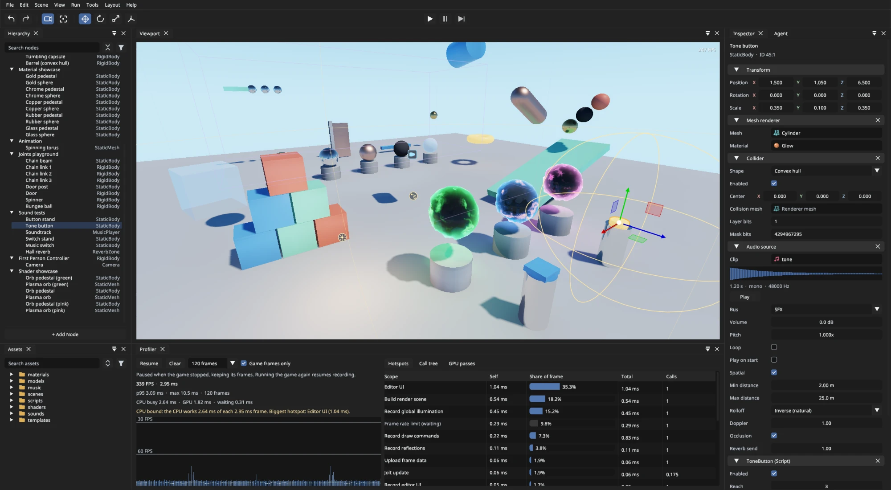
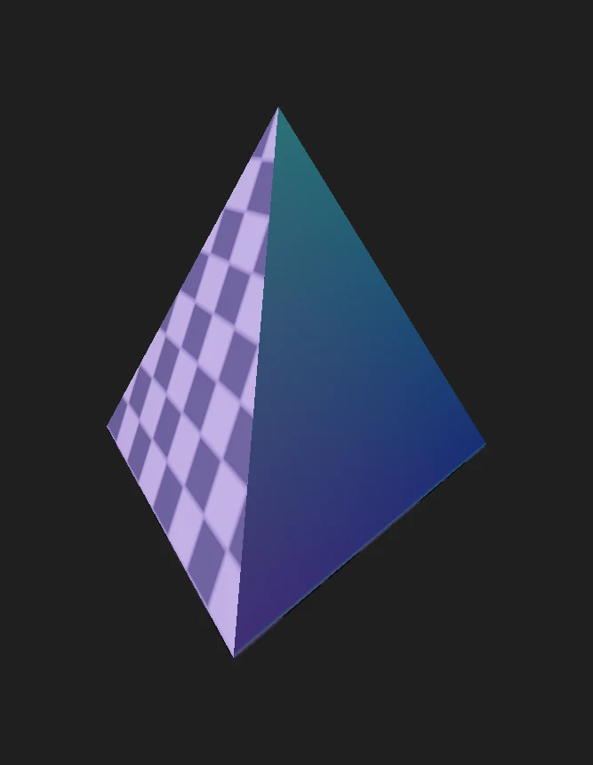
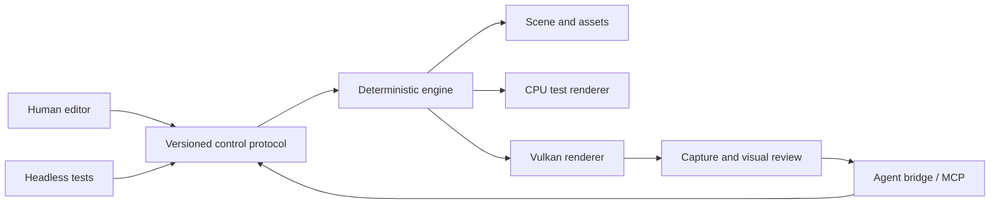

<p align="center">
  
</p>

<h1 align="center">Relay Engine</h1>

<p align="center">
  A native 3D workspace where people and software agents build together.
</p>

<p align="center">
  
  
  
</p>



Relay is an experimental game engine and editor built around a shared control surface. The editor,
automation, tests and AI agents all work through the same typed protocol, so an agent can inspect
the scene, edit it, render the result, look at the capture and correct its work while a person
edits the same project alongside it.

## Highlights

- **Editor** — dockable hierarchy, inspector, viewport, asset browser with thumbnails, timeline,
  profiler, mixer and shader graph editor, built with SDL3 and Dear ImGui.
- **Agents built in** — an embedded chat workspace with sign-in, attachments, inline renders and
  permission controls; agents frame, capture and review the viewport as they work.
- **One typed API** — 167 versioned native methods for scenes, assets, rendering, capture and
  authorization, generated for C++, TypeScript and an MCP bridge.
- **Rendering** — Vulkan HDR pipeline with PBR materials, cascaded and punctual shadows, sky, sun
  and fog, and AMD FidelityFX global illumination and ray traced reflections.
- **Shaders** — surface and post-processing shaders edited as node graphs, saved as readable
  GLSL-based code, with materials, per-object values and ready-made effects.
- **Gameplay** — components, node types and templates, native C++ scripts with hot reload that
  spawn, reparent and reconfigure nodes and shape cast, input mapping, Jolt physics with joints,
  and a playable first person demo.
- **Game interface** — Godot-style canvases, anchored controls and containers: labels, images,
  buttons, check boxes, sliders and progress bars, laid out and drawn in an Interface editor and
  shown over the game while it runs.
- **Particles** — emitters with shapes, bursts, forces, turbulence, collisions, sub emitters,
  flipbooks, curves and gradients, lit and soft particles, previewed live in the editor.
- **Audio** — spatial sources, mixer buses and effects, reverb zones, occlusion, streaming music
  and a headphone mode.
- **Assets** — glTF/GLB, OBJ, FBX, DAE and sandboxed Blender import with animation, skinning and
  morph targets.
- **Deterministic core** — fixed-step simulation, transactional undo/redo, strict validation and a
  CPU renderer used as a headless test oracle.

<p align="center">
  
  <br>
  <sub>A scene assembled and reviewed through Relay's agent tools.</sub>
</p>

## Getting started

You need CMake 3.25+, Ninja, Python 3.10+ and a C++20 compiler. The editor also needs SDL3,
Vulkan, `glslc` and `glslangValidator`; custom shaders use the system glslang. CMake fetches the
remaining pinned dependencies.

```sh
cmake --preset dev
cmake --build --preset dev
./build/dev/relay_demo
```

Development builds open the demo project in [`examples/demo`](examples/demo). Press **Run Game**
(F5) to walk around its showcase as a first person player; the first run asks you to trust the
project so its scripts can build. `./build/dev/relay_demo --headless` runs without a display.

To use agents, install the bridge (Node.js 24+ and a current Codex CLI) and start the editor with
it, then sign in under **Agent → Account**:

```sh
npm --prefix tools/mcp-bridge install
npm --prefix tools/mcp-bridge run build
./build/dev/relay_demo --editor
```

Credentials and conversations stay in the ignored `.relay/` directory, and every agent action
passes the engine's native authorization checks.

## Tests

```sh
ctest --preset dev
npm --prefix tools/mcp-bridge test
```

The suites run headlessly and never touch the desktop; the Vulkan render test uses SDL's offscreen
driver. Windowed smoke tests in `tests/editor_*_smoke.py` synthesize input and are meant for
deliberate runs on a dedicated desktop.

## Architecture


```mermaid
flowchart LR
    Human[Human editor] --> Protocol[Versioned control protocol]
    Agent[Agent bridge / MCP] --> Protocol
    Tests[Headless tests] --> Protocol
    Protocol --> Engine[Deterministic engine]
    Engine --> Scene[Scene and assets]
    Engine --> CPU[CPU test renderer]
    Engine --> GPU[Vulkan renderer]
    GPU --> Capture[Capture and visual review]
    Capture --> Agent
```

The engine has no model-provider dependency: provider integration lives in the external
TypeScript bridge, while permission checks and mutations stay native. One protocol schema
generates the C++, TypeScript and reference documentation.

## Documentation

- [Using the editor](docs/editor.md) — panels, workflows, physics, audio, sky and the demo
- [Gameplay scripting](docs/scripting.md) — writing, building, trusting and hot reloading scripts
- [Shaders and materials](docs/shaders.md) — the shading language and materials
- [Game interface](docs/interface.md) — canvases, controls, the Interface editor and UI scripting
- [Protocol reference](docs/protocol.md) — every method, its parameters and safety annotations
- [Agent bridge](tools/mcp-bridge/README.md) — provider integration and bridge behavior
- [Engineering handoff](HANDOFF.md) — implementation state, limits and next priorities

## Status

Relay is a Linux-first research project under active development; APIs and file formats may still
change. The renderer is verified on Linux with RADV; Windows and macOS parity, script loading on
Windows and wider import sandboxing are still in progress. Relay targets local, single-user
authoring and treats project files and imported assets as untrusted input. Native gameplay scripts
run with your permissions, so Relay builds them only for projects you have trusted.
