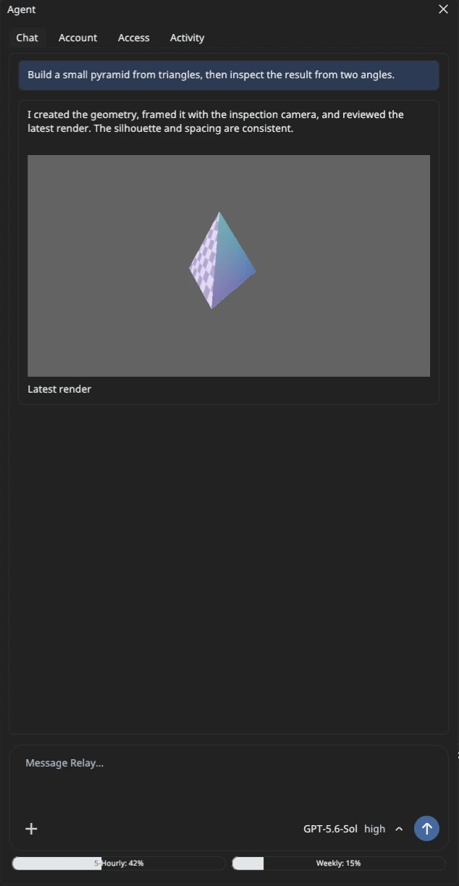

# Using the Relay editor

A tour of the editor's panels and workflows. See the [README](../README.md) for building and
running Relay, and the [scripting](scripting.md) and [shader](shaders.md) guides for code.

## Layout

The editor remembers its layout between sessions and builds: docked and floating panels, which
panels are open, and the **View** menu toggles. They are saved per user in
`~/.config/relay-engine/editor-layout.ini` on Linux (`%APPDATA%\Relay` on Windows,
`~/Library/Application Support/Relay` on macOS). **Layout → Reset layout** restores the default
arrangement, and `RELAY_EDITOR_LAYOUT_PATH` points the editor at another file.

## Nodes, components and templates

A node is a Transform plus the components you give it. The **Inspector** shows only the
components a node has; switch one off, like Unity, with the checkbox on its header, left of the
**×**, and on again without losing its settings (a disabled mesh renderer is not drawn, a disabled
camera is never the active one, a disabled collider, body, joint, script, light, audio source,
emitter, keyframe animation or interface widget is ignored). The Transform and Model animation have
no checkbox. Remove one with the **×** on its header (or right-click → **Remove component**). **+ Add Component** at the bottom opens the Add Component window: categories on the
left, engine components and your script behaviours on the right, a description of the selection,
and search. The Transform cannot be removed.

**+ Add Node** at the bottom of the Hierarchy (also **Scene → Add Node...** and the Hierarchy's
context menu) opens the Add Node window. Node types are shown as a tree: each type inherits its
parent's components and adds its own, so a Rigid Body is a Node with a collider (Physics Body)
and a dynamic physics body. The details pane shows the inheritance chain, description and
components. Light and Physics Body are categories; pick one of the types beneath them. The
Hierarchy labels each node with the deepest type its current components match, so removing a
Static Mesh's mesh renderer makes it a plain Node and adding a camera makes it a Camera.

Right-click a node and choose **Save as template...** to store it and its children in the
project's `templates/` folder. Custom templates appear in the Add Node window's type tree under
the node type their root inherits, so a template of a dynamic body sits under **Physics Body ›
Rigid Body**. A palette icon marks each one; hover it to see "Custom template". Creating one makes
an independent copy, like a prefab without a live link. You can also double-click a template file
in Assets or drag it into the viewport.

## Hierarchy

The **Hierarchy** lists the scene's nodes. Right-click empty space to create a node, or a row to
add a child, duplicate, move, rename, save as a template, or destroy it. Rename in place with
**F2**, **Rename** in the context menu, or a second, slower click on the selected row; **Enter** or
clicking away commits and **Escape** cancels. Drag rows onto each other to reparent them.
Type in the search box at the top (**Ctrl+F** while the panel is focused) to find nodes by name,
and use the funnel button to show only certain node types; a category such as Light includes its
directional, point and spot lights. Results list each match with its parents; double-click one or
choose **Show in hierarchy** to jump back to it in the tree. **Escape** clears the search. The
chevron button left of the funnel collapses every node, or expands them all when all are
collapsed.

## Assets panel

The **Assets** panel shows the open project folder as a tree. Expand a folder with its arrow, a
double-click, or the arrow keys. Right-click empty space to create a folder at the top level, or a
folder to create one inside it; right-click any entry to rename or delete it. **F2** and **Delete**
also work. Deleting moves the entry into the project's hidden `.relay-trash` folder, where it can be
recovered by hand. Drag entries onto a folder to move them there, or onto the empty space below the
tree to move them to the top level. Type in the search box (**Ctrl+F** while the panel is focused)
to find assets by name anywhere in the project, and use the funnel button to show only models,
scenes, templates, images, shaders, scripts, text, audio and video, folders, or other files; the
menu stays open so several categories can be ticked at once. Right-click an entry and choose **Open
in file browser** to show it in your system file manager. Results list each match with its folder;
double-click a folder result or choose **Show in folder** to jump back to the tree there. **Escape**
clears the search. The chevron button left of the funnel collapses every folder, or opens them all
when all are closed. The project's `.relayproject` file is not listed; the Project panel manages it.
The project's member scenes cannot be moved or deleted from here. To bring a model into the scene,
double-click it, drag it into the viewport (it lands on the ground under the pointer) or onto a
hierarchy row (it becomes a child), or right-click it and choose **Import to scene**.

## Asset references and the Asset Browser

Inspector fields that refer to an asset (a mesh, material, shader, texture, sound, sky material,
or another node such as a joint's partner) show a small icon for the kind of asset and its name,
without folders or file extension. Hover a field to see the full path, or right-click it to show the file
in Assets. Drag a file from Assets or the Asset Browser, or a node from the Hierarchy, onto a
field to use it: while you drag, the fields that can take it are outlined, and anything else is
refused with a note saying what the field needs (a sound cannot go into a mesh field). Dropping a
model whose several meshes fit a mesh field opens the browser inside that model. Hierarchy rows are
selected when you let go, so dragging one does not change what the Inspector shows. Clicking the
field opens the **Asset Browser**: the project's folders on the left, and the open folder's subfolders and files on the
right as thumbnails. Images, models, the meshes inside a model, surface materials and sky
materials are drawn as pictures; every other kind has its own icon, and sounds have a play button
to listen to them. The browser lists only what the field can use (**...** → **Show files that do
not fit** lists the rest, dimmed). Search with any words in any order, filter by type with the
funnel, and in **...** choose whether to search the whole project or only the open folder, match
folder names too (so `trees bark` finds `textures/trees/Oak_bark.png`), sort by name, type, size or
folder, and switch between thumbnails of any size and a list. Double-click an item or press
**Choose**; buttons along the bottom offer choices such as **None** and actions such as **New
material**. Imported meshes and materials are inside the model file they came from, and Relay's
own are under **Built-in**. Arrow keys, **Enter**, **Backspace** (up a folder), **Ctrl+F** and
**Escape** work while it has focus. **Tools → Asset browser** opens it just for browsing, and files
can be dragged from it into fields, the viewport or the hierarchy.

## Keyframes and export

Select an entity and open **Transform keyframes** in the Inspector to add, edit, scrub, or play
position, rotation, and scale keys. To share a project, save its scenes, then use **Export saved
project** in the Project panel. Relay writes an uncompressed `.tar` under that project's `exports/`
folder, containing the project metadata, member scenes, and non-hidden assets. Export refuses to
overwrite an existing package.

## Graphics settings

**Edit → Game Configuration... → Graphics** turns lighting effects on or off for the project.
**Global illumination** traces the scene's light through a sparse distance field that AMD
FidelityFX Brixelizer keeps up to date, so surfaces pick up color and shadow from their
surroundings and rough surfaces reflect them softly. **Ray traced reflections** trace hardware
rays for smooth surfaces and denoise them with FidelityFX. Both are on by default and are saved
in the project file under `settings.graphics`. The page says whether each effect is running; on a
GPU without the Vulkan features they need (ray queries for reflections), Relay keeps the analytic
sky light. **Vsync** (off by default) shows frames in step with the display; off, frames appear as
soon as they are ready, which is faster but can tear. **Frame rate limit** caps frames per second
while the game runs; pick a preset or type a value, and 0 (**Unlimited**) removes the cap. The editor itself draws at most 250
frames per second. Agents use `graphics.settings` and `graphics.set_settings`.

## Running the game and profiling

Use **Run Game** (F5) from the toolbar or Run menu to test the current scene, and **Stop Game**
(F8) to end it; both keys work while the game has input. The game viewport uses the
active scene camera. The game logic runs at a fixed 60 steps per second; frames drawn between
steps blend the last two, so motion stays smooth on high refresh rate displays. Scene edits and
saves are unavailable during the run; **Stop Game** restores
the scene as it was when the run began. Pause and frame step control the running game only.
To see what slows the game down, open **Tools → Profiler** (also under **View**) and run the game.
The panel names the bottleneck (CPU, GPU, or waiting on the display) and graphs recent frame
times; click a bar to inspect a single frame. **Hotspots** ranks CPU work by self time, **Call
tree** shows where each millisecond goes (simulation, each script behaviour, physics, rendering,
editor UI, and waits), and **GPU passes** times shadows, the G-buffer, global illumination,
reflections and the rest on the GPU. Stopping the game pauses the profiler so its frames stay
available. Agents use `profiler.read` and `profiler.set`.

## Colliders, bodies and viewport markers

Select an entity and open **Collider** in the Inspector to add a box, sphere, capsule, convex hull,
or triangle mesh. Convex and mesh colliders use the entity's renderer mesh unless you choose a
separate collision mesh; the other shapes are independent of the visible mesh. Its layer and mask determine which other colliders it can overlap; raycasts can also
filter by layer. The queries report intersections without changing objects. The editor camera
outlines each collider's shape in the viewport: selected colliders are amber, enabled colliders
are green, and disabled colliders are gray. Toggle them with **View → Collider wireframes**.
Sphere and capsule shapes use the largest world scale axis as their uniform scale. Convex and mesh
colliders follow the full scale, including non-uniform scale. Triangle meshes suit static floors
and level geometry; a dynamic body with a mesh collider uses the mesh's convex hull instead.
The editor viewport also shows clickable camera and light icons. Directional, point, and spot
lights have distinct markers; selecting a camera shows a compact perspective or orthographic
view guide. The guide preserves the camera's field of view and aspect but caps its display size.
These guides can be toggled from **View** and stay out of Run Game.
Open **Physics body** in the Inspector to make an object static or dynamic. **Lock rotation**
keeps a dynamic body upright, so collisions push it around without tipping it over, as characters
need. Dynamic bodies fall under gravity and respond to enabled colliders during Run Game. A
collider without a body is static. Mass, gravity scale, bounciness, friction, and linear/angular damping are editable;
Stop Game restores authored positions. Jolt uses continuous collision detection for dynamic
bodies. An off-center `physics.apply_impulse` command adds rotation as well as linear motion.
Bodies with transform keyframes follow those keys rather than dynamic simulation.
The Inspector clamps a box-collider half extent entered as zero to 0.01 units, so thin floors
remain valid. Protocol requests with zero extents are rejected.
During Run Game, `physics.contact_events` reports contact `begin` and `end` pairs in sequence
order. Pass the last sequence as `after` to read new events; `oldest_sequence` shows when older
events have left the bounded history. Stop Game clears the stream.

## Joints

Add a **Joint** component (Physics category) to link a node's physics body to another node's body,
or to a fixed point in the world when **Connected to** is **World**. **Fixed** welds the two
together, **Point** is a ball and socket, **Hinge** turns about an axis with optional angle limits
and a motor, **Slider** moves along an axis with optional travel limits and a motor, and
**Distance** is a rope or, with a spring frequency, a bungee. The anchor and axis are in the
node's own space. At least one of the two bodies must be dynamic, and the Inspector says when
neither is. Joined bodies pass through each other unless **Collide with connected** is ticked.
Removing the connected node disables the joint rather than tying it to the world. The collider
wireframes also show joints: a cross at the anchor, the hinge or slider axis, and a line to the
connected body. Scripts can read a joint's angle, travel or length and drive its motor. The demo
has a joints playground behind the material row: a swinging chain, a hinged door, a motorised
spinner and a ball on a spring.

## Scripts

Gameplay code is native C++. Choose **Create → C++ script...** in the Assets panel (or **New C++
script...** in the Add Component window), add the behaviour to a node as a script component, and
press **Run Game**. A node can carry several scripts, and fields a behaviour declares as
properties are editable per node in the Inspector. Relay builds the project's scripts first and
starts the game when they compile; errors appear under **Diagnostics → Scripts** with file and
line. Saving a script while the game runs rebuilds it and swaps in the new code.
Because scripts run with your full user permissions, Relay only builds a project's scripts after
you trust that project. See the [scripting guide](scripting.md).

## Input

Player input goes through the project's input map. **Edit → Game Configuration...** opens the Input
page, where actions (buttons such as `jump`) and axes (values from -1 to 1 such as `move_x`) list
their bindings. Click **+ Add**, **+ Keys** or **+ Stick** and press the key, mouse button or
gamepad control to bind; keys are recorded by physical position, so WASD stays in place on other
keyboard layouts. New projects start with move, look, jump, interact, fire and sprint. The map is
saved in the project's `.relayproject` file, under `settings`; projects that kept it in an older
`input.relay-input.json` move it there the next time the project is saved. During Run Game, click
the viewport to give the game keyboard and mouse input and press **Escape** to hand it back to the
editor; the Input page can also lock the mouse cursor while the game has input, for first-person
controls.

## Audio

Sound files (.wav, .flac, .mp3, .ogg) anywhere in the project show up in the Assets panel.
Create an **Audio Source** node (or add an **Audio source** component) and pick a clip by clicking
the clip field, or drag a sound file onto the clip field; **Play** previews it in the editor. During Run Game a spatial
source gets quieter with distance between its minimum and maximum distance and pans around the
listener; turn **Spatial** off for music and interface sounds. Add an **Audio listener** to the
player's camera (without one, the active camera listens). Each source plays into a mixer bus;
**Edit → Game Configuration... → Audio** edits the project's buses (Master with Music, SFX,
Ambience and Voice to start) with volume, mute, solo and live level meters, and shows which sound
device is in use. **Tools → Audio mixer** opens the Mixer: a strip per bus with a fader you hear
as you drag it, meters, mute and solo, and an effect chain; select an effect to edit it beside
the strips. A **Reverb Zone** node (box or sphere, with a fade distance around it) gives the space
inside it a room's reverb, from presets such as hall or cave; the viewport outlines zones, and a
selected source's minimum and maximum distance. Spatial sources behind colliders are muffled
automatically (turn **Occlusion** off per source). Drag a sound file into the viewport to place it
as an Audio Source, or double-click it in Assets to hear it. A **Music Player** node plays a
playlist during Run Game, crossfading between tracks on the next beat or bar; long files stream,
so tracks can be any length. The Audio page switches between **Speakers** and **Headphones**. Set
`RELAY_AUDIO=0` to run the editor silently.

## Sky, sun and fog

A **Sky** node (Add Node → Sky) sets the scene's sky, sun and fog. Its **Skybox** is either a
gradient, with a **Horizon** color for the horizon and everything below it and a **Zenith** color
for straight up, or a sky material: a `.relay-material` file wrapping an equirectangular (2:1)
PNG or JPEG panorama, such as an exported photo sphere, with a tint, brightness and rotation.
Create one with **New sky material** in the Skybox picker or **Create → Sky material** in Assets,
choose its panorama in the Inspector, and drop material files onto the Skybox field. **Intensity**
brightens the visible sky and **Ambient light** sets how strongly the sky lights the scene,
including global illumination and reflections of the sky. The node's directional light is the
sun: it is drawn in the sky where its light comes from, so rotate the node to move both. **Fog** fades surfaces from its **Start** distance to its
**End** distance, blending from the start color to the end color; the sky itself is not fogged.
Only the first Sky node in the scene is used. Without one, the scene keeps its plain background
and default ambient light.

## Shaders and materials

Custom shaders are `.relay-shader` files, edited as node graphs. Create one with **Create →
Surface shader** or **Post-processing shader** in Assets and it opens in the **Shader Editor**
(Tools → Shader editor), beside the viewport: add nodes with right-click or Space, drag between
pins to wire them, type values into free pins, and wire results into the output node (Albedo,
Roughness, Emission... for surfaces; Color for post processing; the Vertex tab moves a mesh's
vertices). Parameters in the side panel become material fields. The viewport shows each change a
moment later, **Ctrl+S** saves, and errors outline the node they come from. The saved file is
readable GLSL-based code, which is how agents write shaders too; their code opens as nodes. A material (`.relay-material`) names a
shader and sets its uniforms: pick one as a Mesh renderer's **Material**, where a preview
sphere, its shader and fields appear, with **This object only** for values that belong to one
object (scripts change them with `set_material_parameter`). Add post-processing materials to a
**Post Process** node, or pick Bloom, Color Grading or Vignette from its **Add effect** menu to
copy one of Relay's ready-made effects into the project (each effect can be kept out of the
editor's view). The demo has three hovering plasma orbs, bloom and motion blur for the player's
camera. See the [shader guide](shaders.md).

## Particles

A **Particle Emitter** node (Add Node → Particle Emitter, or the **Particle emitter** component
under **Effects**) emits sprites for sparks, smoke, fire, dust, rain, magic and explosions. Emitters
play in the editor, so you see the effect as you tune it; the Inspector's **Pause**, **Restart**,
**Stop** and **Burst** buttons control the preview. Settings are grouped: the emitter's cycle and
space, emission rate and bursts, the shape it emits from (outlined in the viewport when selected),
each particle's start values, motion (gravity, wind, drag, turbulence), size and color over its life
(edited as a curve and a gradient), collisions, flipbook textures, how it draws (additive or alpha,
billboard or stretched, brightness, lit, soft edges), and a sub emitter fired where particles die.
The demo has a campfire, fireworks and trails behind the balls you throw. See the
[particle guide](particles.md).

## Game interface

Interface nodes (Add Node → **Canvas**, then Label, Button, Panel, Image, Check Box, Slider,
Progress Bar and the Vertical Box, Horizontal Box and Grid containers under it) make HUDs and
menus. They draw over the game's view during **Run Game** only; the viewport's own camera never
shows them. Their Inspector replaces the Transform with the **Control** section: Godot-style
anchors with presets, position and size (or margins when stretched), pivot, rotation, scale,
opacity and order. **Tools → Interface editor** (or **Open the Interface editor** in the Inspector)
opens a panel beside the viewport that draws the interface at a chosen screen size; click controls
to select them, drag to move them and drag their handles to resize them. Scripts hear clicks through
`on_ui`. See the [interface guide](interface.md).

## Demo project

In the development build, the editor opens the demo
project in [`examples/demo`](../examples/demo) when started from the repository root. Its showcase
scene has PBR materials, cascaded sun, point, and spot shadows, keyframed animation, and physics and
joints playgrounds. **Run Game** puts you in them as a first person player: an upright capsule body,
a camera at eye height, and the project's `scripts/FirstPersonController.cpp` for mouse, keyboard
and gamepad look, walking, sprinting, jumping and shooting balls where you look. For sound, bodies
thump as they land or are hit, louder the harder the hit; the spinning torus hums, so walking
around it pans and fades the sound; and the glowing button just ahead and to the right plays the
next note of a scale when you look at it and press **E** (or shoot it). A campfire to the front left burns with flames, rising embers and lit smoke,
fireworks go up to the right, and every ball you throw leaves a glowing trail. The joints playground
sits in a hall reverb zone, and crates between you and a sound muffle it. A generated soundtrack
plays throughout; the blue pad to the left of the start moves it to the next track on the next bar,
the tone button ducks it under each note, and every shot has its own sound. A HUD shows control
hints, a crosshair and how many balls you have fired; **Tab** opens a menu (the project's
`scripts/GameMenu.cpp`) with a Resume button, a switch for the hints and a music volume slider,
freeing the cursor while it is open. The first Run Game
asks you to trust the project so its scripts can build. The player is also a **First Person
Controller** template for other scenes, and its script is editable like any other (see the
[scripting guide](scripting.md)). The player's camera is the scene's camera. Set
`RELAY_OPEN_DEMO_PROJECT=0` to start with an empty scene instead; release builds always do. `python3
tools/generate_demo_project.py` rebuilds the demo from code after a dev build.

## Agent workspace

  

The Agent panel keeps conversation, file attachments, rendered images and videos, model controls,
permissions, activity, and account usage inside the editor. Agents work against the same live scene
as the human operator and can use viewport captures to check and refine their results. Open
**Agent → Account** to sign in with ChatGPT or configure a compatible API.
